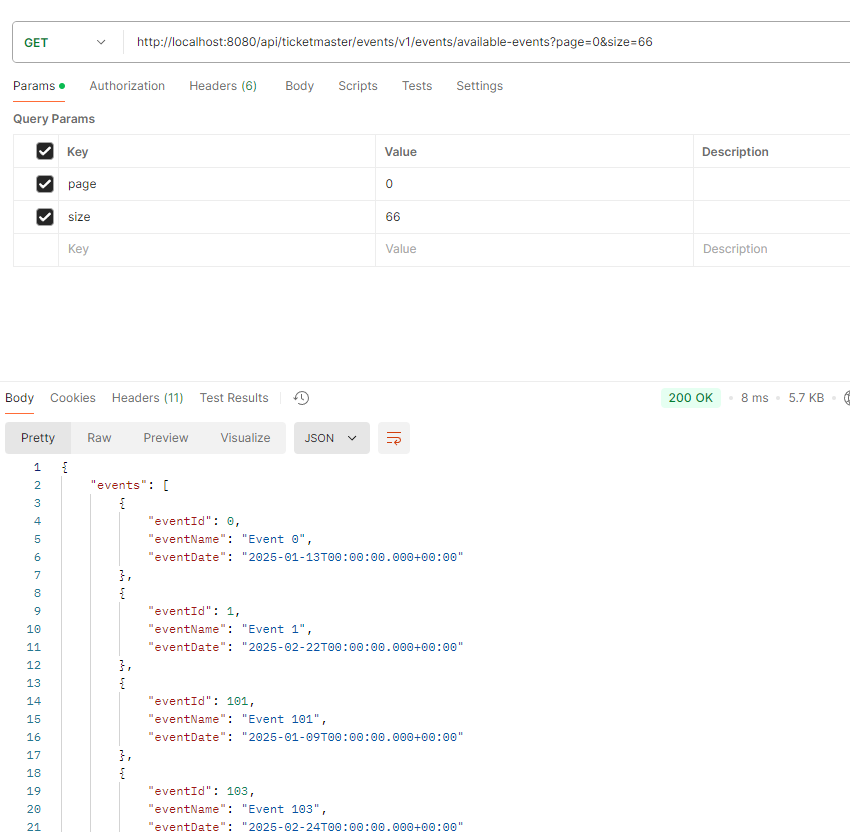
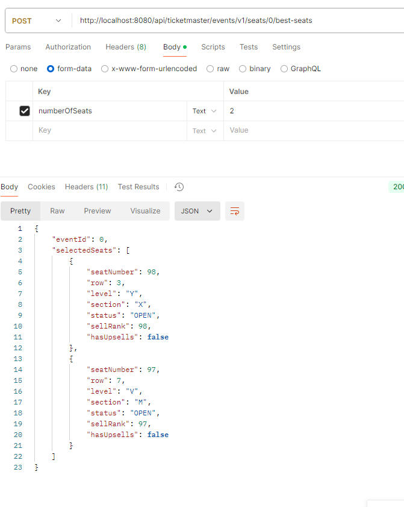

# ticketmaster-events
Fournir des détails sur des évènements à venir

- ci-dessous les deux scénarios happy path pour les fonctionnalités suivantes ,  pour plus de détails sur les scénarios , merci de consulter le dossier postman.
1.	Une route d’API pour rechercher tous les spectacles disponibles, retournés par ordre alphabétique et/ou par date d’évènement;

2.	Une route d’API pour faire la sélection des meilleurs sièges pour un évènement. On doit pouvoir demander autant de billets que désirés, tant qu’il y en a de disponibles.

- la solution est contract first , le contrat se trouve dans le dossier contract

pour lancer le projet en local merci d'activer le profil nonsecurity(-Dspring.profiles.active=nosecurity)

